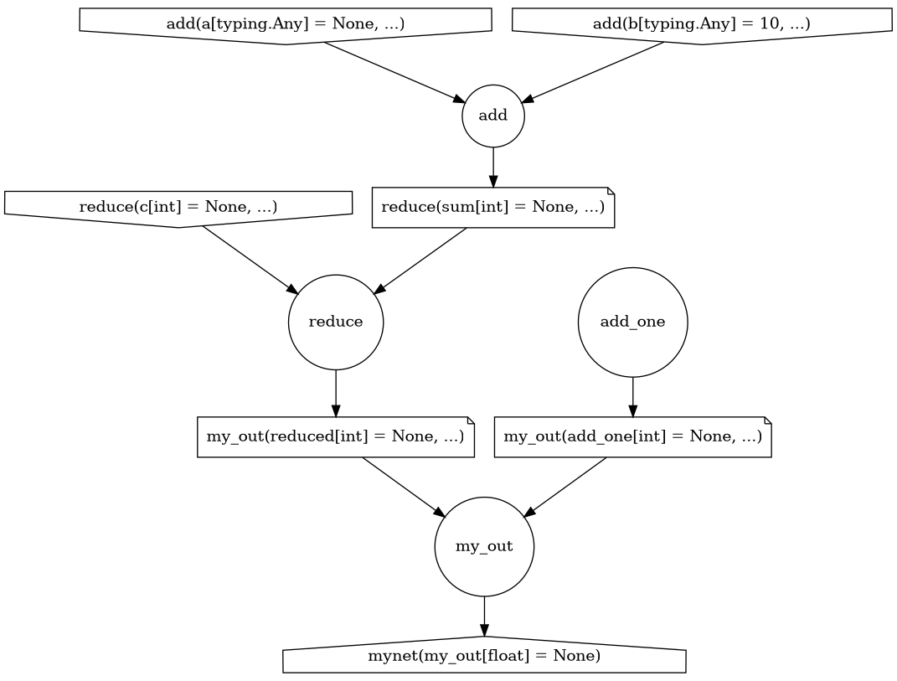

# flowlayer

[![image][]][1]

Easily build your data processing workflows.
---


# Getting started

```python
from datagears import Depends, Feature


def add(a, b) -> int:
    return a + b


def reduce(c: int, sum: int = Depends(add)) -> int:
    return sum - c


def my_out(reduced: int = Depends(reduce)) -> float:
    return reduced / 2


my_graph = Feature(name="mynet", outputs=[my_out]) 
my_graph.plot.view()
```


Which should produce following computational graph:

<p align="center">
    
</p>


To inspect the `input_shape` we can check with:

```python
network.input_shape
> {'c': int, 'a': typing.Any, 'b': typing.Any}
```

To execute our newly composed computation, we can execute it with given parameters:
```python
my_graph.run(a=5, b=3, c=4, d=6)
```

Or register the graph with the backend and execute it from other
processes: 
```python
my_graph.register()
```

  [image]: https://badge.fury.io/py/datagears.png
  [1]: http://badge.fury.io/py/datagears
